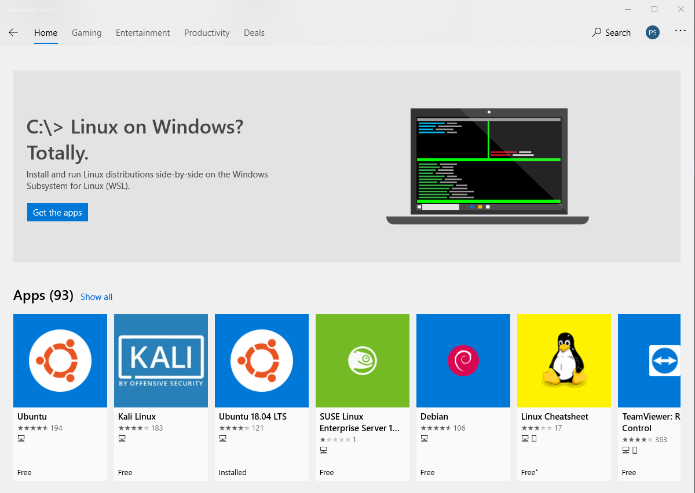

# Windows Subsystem for Linux

Guide for enabling WSL and installing a Linux distro from the Microsoft Store

## Install the Windows Subsystem for Linux

Before installing any Linux distros for WSL, you must ensure that the "Windows Subsystem for Linux" optional feature is enabled:

1. Open PowerShell as Administrator and run:

```PowerShell
Enable-WindowsOptionalFeature -Online -FeatureName Microsoft-Windows-Subsystem-Linux
```

2. Restart your computer when prompted.

## Install your Linux Distribution of Choice

1. Open the Microsoft Store, search "linux" and choose your favorite Linux distribution.  I am using Ubuntu 18.04 LTS currently.



2. From the distro's page, select "Get"

## Complete initialization of your distro
Now that your Linux distro is installed, you must initialize your new distro instance once, before it can be used.  Just search for the name of your install Linux distro from the Start Menu and launch it.